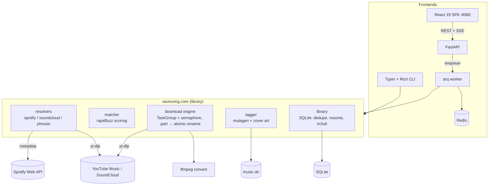

# SaveSong — Implementation Spec (CLAUDE.md)

Single source of truth for implementing SaveSong from an empty repo. Do not ask clarifying questions. Versions are minimum known-good; resolve latest with `uv lock`.

**Licensing constraint (hard rule):** this is a clean-room implementation. Do NOT copy, port, or paraphrase code from `downtify` or any GPL project. Concepts are fair game; code and structure are not. License: MIT.

**Legal posture:** the tool is for personal archiving of content the user has rights to access. README carries a clear disclaimer; CI and tests never download from commercial services — fixtures are local files and mocked HTTP. No API keys or cookies are bundled.

---

## 1. Project

### Overview
SaveSong downloads playlists and tracks from three sources through one async engine: **Spotify** (Web API for metadata → each track matched against YouTube Music search results by a scoring engine → audio via yt-dlp), **SoundCloud** and **YouTube Music** (both direct playlist/track extraction via yt-dlp). Files are tagged (mutagen: title, artists, album, track number, year, cover art) and organized `{artist}/{album or playlist}/{nn} - {title}.{ext}`; a SQLite library provides dedupe (skip already-downloaded), resume, and `.m3u8` export. Frontends: Typer CLI (primary) and a self-hosted FastAPI + React web UI with SSE progress (compose mode).

### Goals
1. One typed core engine (`savesong.core`) consumed by both CLI and web — zero logic in the frontends.
2. Bounded-concurrency async downloads with clean cancellation (Ctrl-C leaves no partial files — download to `.part`, atomic rename).
3. A measurable matcher: labeled fixture set (50 Spotify tracks → known-correct YT Music IDs), accuracy reported in docs; threshold below which a track is marked `needs_review` instead of guessing.
4. Idempotent by design: re-running a playlist downloads only new/failed tracks.
5. Installable two ways: `uv tool install savesong` (CLI) and `docker compose up` (web).

### Non-goals
- No DRM circumvention of any kind; Spotify audio is never touched — Spotify is metadata-only, audio comes from YouTube Music matching.
- No user-account OAuth flows (Spotify client-credentials only; public playlists).
- No streaming server/player features (export to files + m3u8 only).
- No distributed workers, no Postgres — this is deliberately a right-sized local tool.

### Features — MVP (CLI)
- `savesong get <url>` — auto-detects source (spotify|soundcloud|ytmusic) from URL; playlist or single track.
- Spotify pipeline: fetch playlist pages → normalize `TrackMeta` → for each track `yt-dlp ytmusicsearch5:"{artist} {title}"` → score candidates (§2.4) → best ≥ threshold → download bestaudio (opus/m4a) → optional ffmpeg convert (`--format mp3|m4a|opus`) → tag + embed cover → record in library.
- SoundCloud/YT Music pipeline: yt-dlp playlist extraction → same download/tag/record path (metadata from extractor).
- Rich UI: overall bar + per-track bars (max N visible), final summary table (downloaded/skipped/failed/needs-review).
- Library: `savesong library list|stats`, `savesong export-m3u <playlist-id> [--relative]`, `savesong retry-failed`.
- Config: `~/.config/savesong/config.toml` (+ env override): music_dir, format, concurrency, spotify creds, match threshold. `savesong config init` scaffolds it.
- `--dry-run` (resolve + match, download nothing — prints match table with scores).

### Features — Stretch (web mode + extras)
- Web UI: paste URL → job queued (arq) → live SSE progress cards → library browser with cover art grid.
- `savesong sync <url>`: diff playlist vs library, download additions, flag removals (no deletes without `--prune`).
- Lyrics fetch (lrclib.net public API) → `.lrc` sidecar; ReplayGain tagging.
- Match review TUI: `savesong review` — interactive pick among top-3 candidates for `needs_review` tracks.
- Homebrew/scoop packaging notes; PyPI publish workflow on tag.

### Main user flows
1. **CLI:** `savesong get https://open.spotify.com/playlist/37i9...` → "Fetched 42 tracks · matching…" → live progress bars → summary: `38 downloaded · 2 skipped (already in library) · 1 failed · 1 needs review` → files organized under `~/Music/SaveSong/...` with tags + cover art, playlist `.m3u8` written.
2. **Re-run/resume:** same command again → `42 skipped` in ~2s (library dedupe by source track id + audio fingerprint of path).
3. **Web:** `docker compose up` → `localhost:8080` → paste SoundCloud set URL → job card animates per-track progress via SSE → Library tab shows covers; failed tracks have a retry button.

---

## 2. Architecture

### 2.1 Stack (pinned minimums)
Python 3.12 · uv ≥0.5 · yt-dlp (latest, `>=2026.1.1` — update at impl time; pin exact in lock) · httpx ≥0.28 · rapidfuzz ≥3.11 · mutagen ≥1.47 · typer ≥0.15 · rich ≥13.9 · pydantic ≥2.10 + pydantic-settings ≥2.7 (+ tomli-w for config scaffold) · SQLAlchemy ≥2.0.36 (async) + aiosqlite ≥0.20 + Alembic ≥1.14 · FastAPI ≥0.115 + uvicorn ≥0.34 + sse-starlette ≥2.2 · arq ≥0.26 + Redis 7.4 (web mode only) · ffmpeg 7 (system dep; bundled in Docker image) · React 19 + Vite 6 + TypeScript 5.7 + Tailwind 4 · pytest ≥8.3 + pytest-asyncio + respx ≥0.22 · ruff ≥0.9 · mypy ≥1.14 strict · pre-commit.

### 2.2 Architecture diagram



### 2.3 Folder structure

```
savesong/
├── CLAUDE.md  STACK.md  README.md  LICENSE  Makefile  CHANGELOG.md
├── .env.example  .gitignore  .pre-commit-config.yaml  docker-compose.yml
├── .github/workflows/ci.yml  release.yml
├── docs/  images/  matching.md      # scoring design + accuracy table
├── pyproject.toml  uv.lock          # [project.scripts] savesong = "savesong.cli.main:app"
├── src/savesong/
│   ├── config.py                    # pydantic-settings: TOML file + SAVESONG_* env layering
│   ├── models.py                    # TrackMeta, MatchCandidate, DownloadResult, JobProgress (pydantic)
│   ├── core/
│   │   ├── resolvers/  base.py  spotify.py  soundcloud.py  ytmusic.py  detect.py
│   │   ├── matcher.py               # score(), pick() — pure functions
│   │   ├── downloader.py            # engine: queue, semaphore, yt-dlp progress hooks → callbacks
│   │   ├── tagger.py  organizer.py  m3u.py  converter.py
│   │   └── library.py               # repo over SQLite; dedupe, retry queries
│   ├── db/  engine.py  tables.py  alembic/
│   ├── cli/  main.py  progress.py  review.py   # rich rendering only — no business logic
│   ├── web/  app.py  routes.py  sse.py  jobs.py   # arq task defs; JobProgress → redis pubsub → SSE
│   └── worker.py                    # arq WorkerSettings
├── web/                             # React SPA (queue + library pages)
│   ├── package.json  vite.config.ts  Dockerfile  nginx.conf
│   └── src/ pages/ Queue.tsx Library.tsx  components/ JobCard.tsx TrackRow.tsx  lib/api.ts
├── docker/  Dockerfile              # python + ffmpeg multi-stage
└── tests/  unit/  integration/  fixtures/
    ├── spotify_playlist.json  ytm_search_results.json   # recorded API shapes
    ├── labeled_matches.json          # 50 tracks → correct video ids + decoys
    └── audio/cc_sample.opus          # CC0 clip for tagger/organizer tests
```

### 2.4 Matcher spec (the heart — implement as pure, heavily tested functions)
Input: `TrackMeta{title, artists[], album, duration_ms, isrc?}` + candidates from `ytmusicsearch5` (`[{video_id, title, channel, duration_s, view_count?}]`).
Score = `0.45 * fuzz.token_set_ratio(norm(track.title), norm(cand.title))/100`
 + `0.30 * best artist ratio vs channel/cand.title`
 + `0.15 * duration score (1.0 if |Δ| ≤ 3s, linear to 0 at 15s)`
 + `0.10 * bonuses (official audio/topic channel +, live/cover/remix/sped-up keywords − unless present in source title)`.
`norm()` strips feat./parenthetical noise, lowercases, removes punctuation. Pick top; if score < `match_threshold` (default 0.72) → `needs_review` with top-3 stored. Document + tune against `labeled_matches.json`; report accuracy in `docs/matching.md` (target ≥ 90% top-1 on the fixture set).

### 2.5 Database schema (SQLite via Alembic)

```sql
CREATE TABLE playlists (
  id           INTEGER PRIMARY KEY,
  source       TEXT NOT NULL CHECK (source IN ('spotify','soundcloud','ytmusic')),
  external_id  TEXT NOT NULL,
  title        TEXT NOT NULL,
  url          TEXT NOT NULL,
  last_synced_at TEXT,
  UNIQUE (source, external_id)
);

CREATE TABLE tracks (
  id            INTEGER PRIMARY KEY,
  playlist_id   INTEGER REFERENCES playlists(id),
  source        TEXT NOT NULL,
  external_id   TEXT NOT NULL,           -- spotify track id / sc id / yt video id
  title         TEXT NOT NULL,
  artists       TEXT NOT NULL,           -- JSON array
  album         TEXT,
  duration_ms   INTEGER,
  cover_url     TEXT,
  status        TEXT NOT NULL DEFAULT 'pending'
    CHECK (status IN ('pending','matched','downloading','done','failed','needs_review','skipped')),
  matched_video_id TEXT,
  match_score   REAL,
  match_candidates TEXT,                 -- JSON top-3 for review
  file_path     TEXT,
  error         TEXT,
  downloaded_at TEXT,
  UNIQUE (source, external_id, playlist_id)
);
CREATE INDEX tracks_status ON tracks (status);

CREATE TABLE jobs (                      -- web mode
  id          TEXT PRIMARY KEY,          -- arq job id
  url         TEXT NOT NULL,
  state       TEXT NOT NULL DEFAULT 'queued'
    CHECK (state IN ('queued','resolving','running','done','failed','cancelled')),
  total       INTEGER DEFAULT 0,
  completed   INTEGER DEFAULT 0,
  failed      INTEGER DEFAULT 0,
  created_at  TEXT NOT NULL,
  finished_at TEXT
);
```

### 2.6 API endpoints (web mode, prefix `/api`; single-user, no auth — bind localhost by default, document reverse-proxy auth for LAN)

| Method | Path | Request | Response |
|---|---|---|---|
| POST | `/api/jobs` | `{"url": str, "format": "opus"\|"m4a"\|"mp3"}` | `202 {job_id}`; `422 {"code":"unsupported_url"}` |
| GET | `/api/jobs` | — | `[{id, url, state, total, completed, failed, created_at}]` |
| GET | `/api/jobs/{id}` | — | job + `tracks:[{title, artists, status, match_score, error}]` |
| GET | `/api/jobs/{id}/events` | — | **SSE**: `event: progress {"track_id","title","pct","speed"}` · `event: track_done {...}` · `event: job_done {summary}` |
| POST | `/api/jobs/{id}/cancel` | — | `202` |
| POST | `/api/tracks/{id}/retry` | — | `202` |
| GET | `/api/library?cursor=&q=` | — | `{items:[{title, artists, album, cover_url, file_path, downloaded_at}], next_cursor}` |
| GET | `/healthz` | — | `{"status":"ok"}` (checks redis + music dir writable) |

CLI commands (mirror of §1 MVP): `get`, `sync`, `library list|stats`, `export-m3u`, `retry-failed`, `review`, `config init`, `--dry-run`, `--concurrency`, `--format`, `--music-dir`.

### 2.7 Environment variables (mirror in `.env.example`; config.toml equivalents noted)

```bash
SAVESONG_MUSIC_DIR=./music              # toml: music_dir
SAVESONG_DB_PATH=./data/savesong.db
SAVESONG_FORMAT=opus                    # opus|m4a|mp3
SAVESONG_CONCURRENCY=4
SAVESONG_MATCH_THRESHOLD=0.72
SPOTIFY_CLIENT_ID=                      # only needed for spotify source
SPOTIFY_CLIENT_SECRET=
REDIS_URL=redis://redis:6379/0          # web mode only
SAVESONG_WEB_PORT=8080
```

---

## 3. Development workflow

### 3.1 Local setup
CLI dev: `uv sync && uv run savesong --help` (ffmpeg must be on PATH; README links installs). Try without any keys: `uv run savesong get <soundcloud-or-ytmusic-url> --dry-run`. Web dev: `docker compose up redis -d`, `uv run uvicorn savesong.web.app:create_app --factory --reload`, `uv run arq savesong.worker.WorkerSettings`, `npm run dev` in `web/`.

### 3.2 Docker — one command (web mode)
`docker compose up` starts: `redis` (healthcheck) → `migrate` (one-shot: alembic upgrade + seed demo library rows — 5 tracks pointing at the bundled CC0 audio + covers so the Library tab is populated with zero downloads) → `api` (deps on migrate success), `worker` (arq), `web` (nginx SPA :8080, proxies `/api`). Volumes: `./music`, `./data`. Fresh clone → compose up → UI on :8080 with a browsable seeded library; paste a URL to run a real job (Spotify source additionally needs the two env creds).

### 3.3 Makefile targets
```make
dev       # docker compose up --build
test      # uv run pytest -x --cov=savesong --cov-report=term-missing
lint      # ruff check + format --check; npm run lint (web/)
format    # ruff fix + format; npm run format
seed      # uv run python -m savesong.db.seed   (demo library rows)
typecheck # mypy strict; tsc --noEmit
demo-cli  # asciinema-friendly scripted run against fixtures (offline)
```

### 3.4 Testing strategy (coverage ≥85% on `src/savesong`, `--cov-fail-under=85`; **zero network in tests**)
- **Unit:** matcher against `labeled_matches.json` (accuracy gate: fail suite if top-1 < 0.88 to catch scoring regressions); `norm()` table-driven; organizer path templating (unicode, forbidden chars, collisions → ` (2)` suffix); m3u writer; URL detection; config layering (toml < env < flag).
- **Integration:** resolvers with respx-mocked Spotify API (recorded JSON fixtures) and a stubbed yt-dlp (inject a fake `YoutubeDL` that "downloads" by copying `fixtures/audio/cc_sample.opus` and firing progress hooks); tagger round-trip on the CC0 file (write tags → read back with mutagen); library dedupe/resume flows on tmp SQLite; download engine cancellation (assert no `.part` leftovers); web API + one full SSE stream via httpx; arq task with `Worker(burst=True)` against fakeredis or a redis testcontainer.
- **Frontend:** vitest smoke for api client + JobCard rendering from fixture events.

### 3.5 CI (GitHub Actions)
`ci.yml`: lint, typecheck (mypy + tsc), test (Linux + Windows runners — path handling matters for a file tool), build wheel + `uvx --from dist/*.whl savesong --help`, docker build. Coverage → Codecov. `release.yml` on tag: build + GitHub release (PyPI publish optional, decide at v1).

### 3.6 Conventions
- ruff (line 100) + mypy `--strict`, full typing, `py.typed`; core functions pure where possible (matcher, organizer, m3u) — frontends do IO orchestration only.
- Conventional Commits; `CHANGELOG.md` Keep-a-Changelog.
- yt-dlp interactions isolated behind `downloader.py`/resolver seams so its API drift touches one module.
- **Git rules: never add `Co-Authored-By`, "Generated with Claude Code", or any AI attribution to commits or PRs.**

---

## 4. Definition of done
- [ ] `README.md`: hero GIF of the Rich CLI multi-bar download, badges (CI, Codecov, MIT, Python, platforms), install (`uv tool install` + compose), quickstart per source, matching-engine section linking `docs/matching.md` with the accuracy table, web UI screenshots in `docs/images/`, **personal-use legal disclaimer**, roadmap (sync --prune, lyrics, review TUI).
- [ ] `.env.example`; MIT `LICENSE`; `.gitignore`; `.pre-commit-config.yaml`; `CHANGELOG.md`.
- [ ] Fresh clone → `docker compose up` → seeded library browsable at :8080 with no keys and no downloads; `make demo-cli` runs fully offline.
- [ ] Tests green on Linux + Windows, coverage ≥85%, matcher accuracy gate passing, ruff/mypy/tsc clean, CI green.
- [ ] No GPL-derived code anywhere; wheel builds and `savesong --help` works via uvx.
