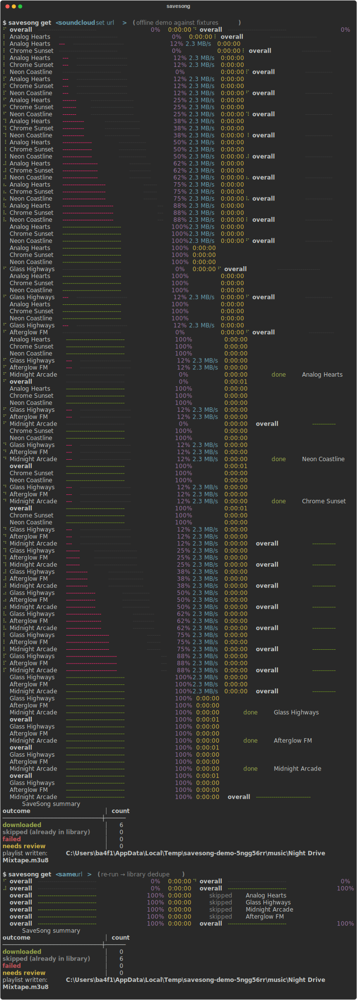
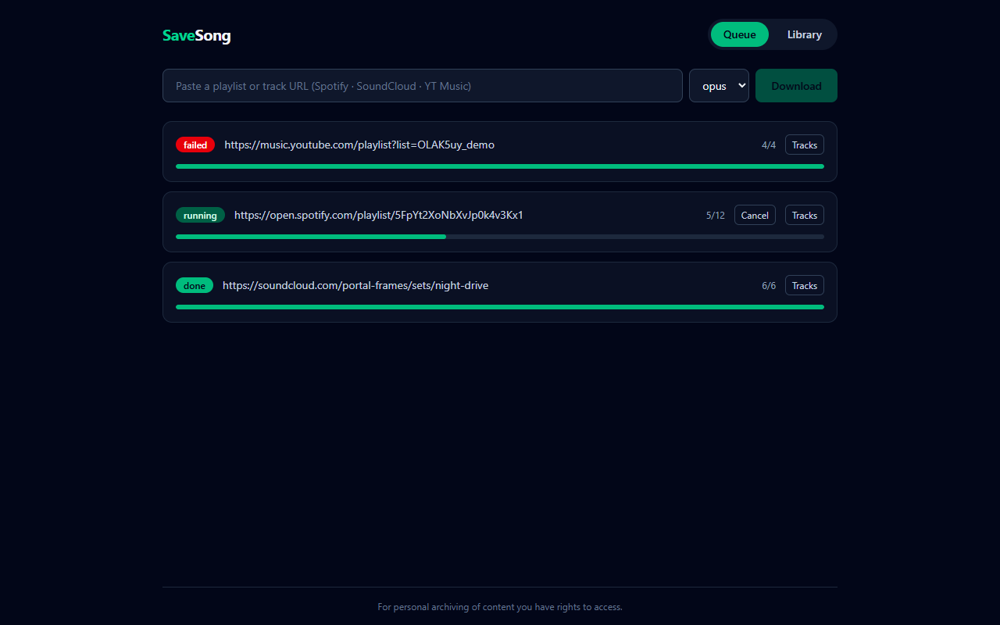
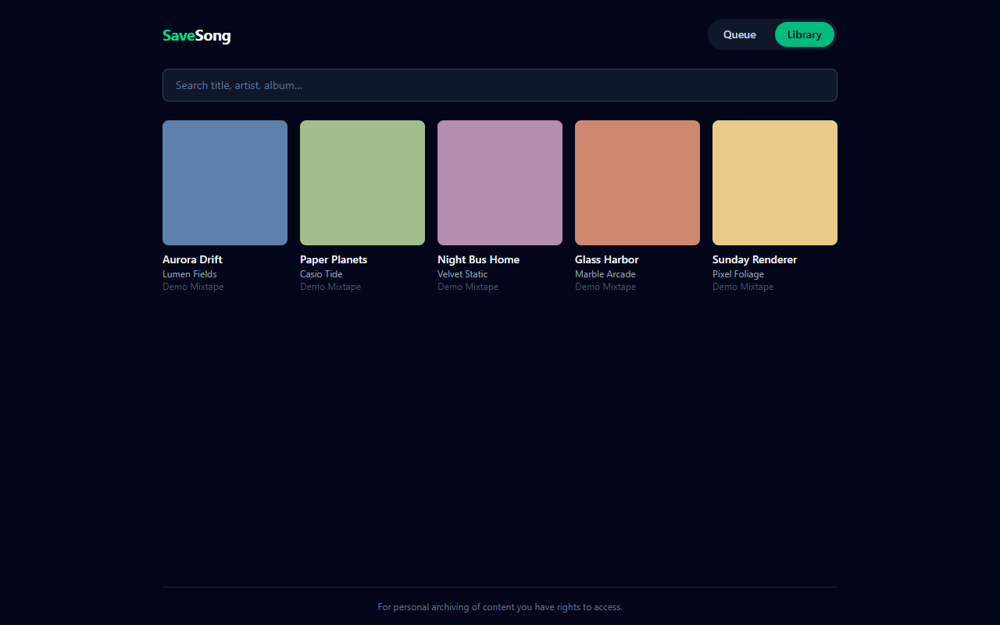

# SaveSong

[](https://github.com/thechekh/savesong/actions/workflows/ci.yml)
[](https://codecov.io/gh/thechekh/savesong)
[](pyproject.toml)
[](LICENSE)


Download playlists and tracks from **Spotify**, **SoundCloud**, and **YouTube Music**
through one typed async engine — tagged with full metadata and cover art, organized on
disk, deduped in a local SQLite library, exported as `.m3u8`.



> [!IMPORTANT]
> **Personal use only.** SaveSong is a tool for personal archiving of content you have
> the rights to access. It performs no DRM circumvention of any kind — Spotify is used
> strictly as a *metadata* source (its audio is never touched); audio comes from public
> YouTube Music / SoundCloud uploads via [yt-dlp](https://github.com/yt-dlp/yt-dlp).
> You are responsible for complying with the terms of the services you use and the laws
> of your jurisdiction.

## How it works

```
spotify URL ──▶ Web API metadata ──▶ YT Music search ──▶ scoring engine ──▶ best match ─┐
soundcloud / yt music URL ──▶ yt-dlp playlist extraction ───────────────────────────────┤
                                                                                        ▼
                       bounded-concurrency downloads (.part staging → atomic rename)
                                                                                        ▼
                 ffmpeg convert (optional) ─▶ mutagen tags + cover art ─▶ SQLite library
                                                                                        ▼
                       {artist}/{album or playlist}/{nn} - {title}.{ext}  +  .m3u8
```

- **One core engine** (`savesong.core`) consumed by two frontends: a Typer + Rich CLI
  and a self-hosted FastAPI + React web UI with live SSE progress.
- **A measurable matcher** instead of "first search result" — fuzzy title/artist
  scoring, duration windows, topic-channel boosts, rendition penalties. Design and
  accuracy table: [docs/matching.md](docs/matching.md). Tracks that score below the
  threshold are queued for **interactive review**, not guessed.
- **Idempotent by design** — re-running a playlist skips everything already on disk;
  `savesong sync` diffs upstream changes; failed tracks are retryable; Ctrl-C leaves no
  partial files (staging dir + atomic rename).

## Install

### CLI

```bash
uv tool install savesong        # or: pipx install savesong
```

[ffmpeg](https://ffmpeg.org/download.html) must be on your `PATH` for format
conversion (`winget install ffmpeg` · `brew install ffmpeg` · `apt install ffmpeg`).

### Web UI (docker compose)

```bash
git clone https://github.com/thechekh/savesong && cd savesong
docker compose up
```

Open <http://localhost:8080> — the Library tab is pre-seeded with five CC0 demo tracks,
so the UI is browsable with **zero API keys and zero downloads**. ffmpeg is bundled in
the image. The port binds to localhost only; to expose it on a LAN put a
reverse proxy with auth in front (the API itself is single-user and unauthenticated).

## Quickstart

### SoundCloud / YouTube Music — no keys needed

```bash
savesong get https://soundcloud.com/artist/sets/some-set
savesong get https://music.youtube.com/playlist?list=OLAK5uy_...
savesong get https://music.youtube.com/watch?v=...          # single track
```

### Spotify — needs client credentials (metadata only)

1. Create an app at <https://developer.spotify.com/dashboard> (any name, no redirect URI
   needed; select only the **Web API** product).
   > **Heads-up:** Spotify currently blocks Web API access for development-mode apps
   > unless the app owner's account has an active **Premium** subscription — API calls
   > return 403 otherwise. SoundCloud and YouTube Music need no keys at all.
2. `savesong config init` and paste `client_id` / `client_secret` into
   `~/.config/savesong/config.toml` — or export `SPOTIFY_CLIENT_ID` / `SPOTIFY_CLIENT_SECRET`.

```bash
savesong get https://open.spotify.com/playlist/37i9dQZF1DXcBWIGoYBM5M
```

```
38 downloaded · 2 skipped (already in library) · 1 failed · 1 needs review
```

### Everyday commands

```bash
savesong get <url> --dry-run          # resolve + match only; prints the match table
savesong get <url> -f mp3 -c 8        # format + concurrency overrides
savesong sync <url> [--prune]         # download additions, flag/delete removals
savesong retry-failed                 # re-attempt failed tracks
savesong review                       # pick among top-3 candidates for low-confidence matches
savesong library list --q daft        # search the library
savesong library stats                # counts + playlist ids
savesong export-m3u 3 --relative      # write an .m3u8 for playlist id 3
```

## Configuration

Precedence: **CLI flag > environment > `~/.config/savesong/config.toml` > default**
(`SAVESONG_CONFIG` overrides the config path; see [.env.example](.env.example)).

| env | toml | default | meaning |
|---|---|---|---|
| `SAVESONG_MUSIC_DIR` | `music_dir` | `~/Music/SaveSong` | library root |
| `SAVESONG_DB_PATH` | `db_path` | `<music_dir>/.savesong/savesong.db` | SQLite path |
| `SAVESONG_FORMAT` | `format` | `opus` | `opus` \| `m4a` \| `mp3` |
| `SAVESONG_CONCURRENCY` | `concurrency` | `4` | parallel downloads (1–16) |
| `SAVESONG_MATCH_THRESHOLD` | `match_threshold` | `0.72` | below → `needs_review` |
| `SPOTIFY_CLIENT_ID` / `SPOTIFY_CLIENT_SECRET` | `spotify_client_id` / `…_secret` | — | Spotify source only |
| `REDIS_URL` | `redis_url` | `redis://localhost:6379/0` | web mode only |
| `SAVESONG_WEB_PORT` | `web_port` | `8080` | compose UI port |

## The matching engine

Every Spotify track is matched against YouTube Music search results by a scoring
engine (`0.45·title + 0.30·artist + 0.15·duration + 0.10·bonuses`) with normalization
for feat./remaster noise, topic-channel boosts, and penalties for live/cover/remix/
sped-up renditions — unless the source track *is* one. Measured on a 50-case labeled
fixture set with realistic decoys:

| metric | value | CI gate |
|---|---:|---:|
| top-1 accuracy | **50/50** | ≥ 0.88 |
| top-3 accuracy | 50/50 | — |

Full design, caveats, and tuning workflow: **[docs/matching.md](docs/matching.md)**.

## Web mode

`docker compose up` starts redis → one-shot migrate + demo seed → API → arq worker →
nginx-served SPA. Paste a URL, watch per-track progress stream in over SSE, retry
failures from the job card, browse covers in the Library tab.

| Queue | Library |
|---|---|
|  |  |

REST surface (`/api/jobs`, `/api/jobs/{id}/events` SSE, `/api/library`, `/healthz`)
is documented in [CLAUDE.md §2.6](CLAUDE.md) and served with OpenAPI docs at `/docs`.

## Development

```bash
uv sync                        # python deps (uv manages the venv)
make test                      # pytest, coverage gate ≥85%
make lint typecheck            # ruff + mypy --strict + eslint + tsc
make demo-cli                  # offline scripted demo (no network, asciinema-friendly)
make seed                      # seed the demo library rows
make fixtures                  # regenerate CC0 binary fixtures from scratch
uv run python scripts/demo_web.py   # SPA+API on :8765 with fake redis (after `npm run build` in web/)
```

- **Zero network in tests** — Spotify is respx-mocked from recorded response shapes,
  yt-dlp is replaced by a fake that "downloads" a bundled CC0 clip and fires real
  progress hooks, web tests run on fakeredis (including a full SSE stream and an arq
  worker in burst mode). CI runs Linux + Windows.
- The audio/image fixtures are **generated from scratch** by
  [scripts/gen_fixtures.py](scripts/gen_fixtures.py) (hand-built Ogg Opus / MPEG
  frames / PNG) — CC0 by construction, no third-party material in the repo.
- Web dev: `docker compose up redis -d`, then
  `uv run uvicorn savesong.web.app:create_app --factory --reload`,
  `uv run arq savesong.worker.WorkerSettings`, and `npm run dev` in `web/`.

## Roadmap

- `savesong sync --prune` hardening (trash instead of delete)
- Lyrics fetch (lrclib.net) → `.lrc` sidecars; ReplayGain tagging
- ISRC fast-path in the matcher
- Homebrew / Scoop packaging; PyPI publish at v1

## License

[MIT](LICENSE). Test fixtures are CC0 (generated, not sampled). SaveSong is a
clean-room implementation — it shares no code with any GPL project.
